# Workflows Repository - System Architecture Diagram

> **Complete visual reference** for understanding the Workflows repository structure, component relationships, and data flows.

---

## Table of Contents

1. [High-Level Architecture](#high-level-architecture)
2. [Component Breakdown](#component-breakdown)
3. [Workflow Execution Flow](#workflow-execution-flow)
4. [Sync Mechanism](#sync-mechanism)
5. [Keepalive System](#keepalive-system)
6. [LangChain Integration](#langchain-integration)
7. [File Structure Tree](#file-structure-tree)
8. [Data Flow Diagrams](#data-flow-diagrams)

---

## High-Level Architecture

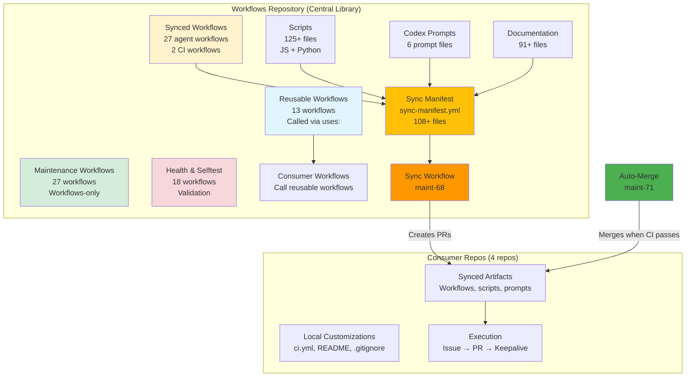

---

## Component Breakdown

### 1. Workflow Categories (88 total workflows)

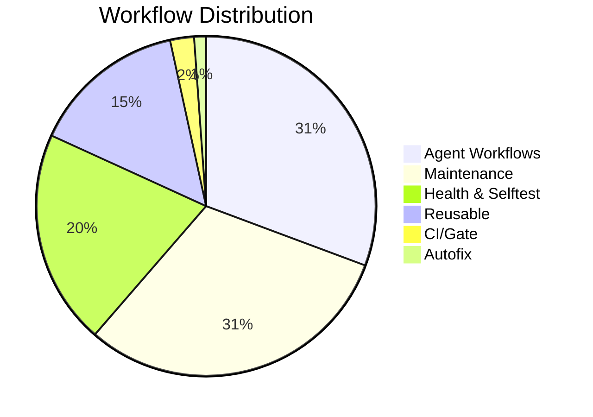

#### 1.1 Reusable Workflows (13 workflows)

**Purpose**: Core building blocks called by consumer repos via `uses: stranske/Workflows/.github/workflows/reusable-*.yml@v1`

```
├── CI Orchestration
│   ├── reusable-10-ci-python.yml ──────► Python lint, test, mypy
│   ├── reusable-11-ci-node.yml ────────► Node.js CI
│   └── reusable-12-ci-docker.yml ──────► Docker build/test
│
├── Agent System
│   ├── reusable-16-agents.yml ─────────► Core agent framework
│   ├── reusable-agents-issue-bridge.yml ► Bootstrap PRs from issues
│   ├── reusable-agents-verifier.yml ───► PR verification
│   ├── reusable-bot-comment-handler.yml ► Bot comment handling
│   └── reusable-codex-run.yml ─────────► Codex agent execution
│
├── Orchestration
│   ├── reusable-70-orchestrator-init.yml ► Orchestrator init
│   └── reusable-70-orchestrator-main.yml ► Orchestrator main loop
│
├── PR Management
│   ├── reusable-20-pr-meta.yml ────────► PR metadata tracking
│   └── reusable-pr-context.yml ────────► GraphQL PR context
│
└── Autofix
    └── reusable-18-autofix.yml ────────► Lint/format auto-fix

🔑 Key Characteristic: NOT synced to consumers (referenced instead)
```

#### 1.2 Agent Workflows (27 workflows - SYNCED)

**Purpose**: Consumer-facing automation and orchestration

```
├── Core Orchestration (5)
│   ├── agents-70-orchestrator.yml ─────► Scheduled orchestration
│   ├── agents-63-issue-intake.yml ─────► Issue → PR bootstrap
│   ├── agents-pr-meta.yml ─────────────► PR comment/dispatch handling
│   ├── agents-verifier.yml ────────────► PR verification checks
│   └── agents-auto-pilot.yml ──────────► Auto-pilot mode
│
├── Keepalive Loop (5)
│   ├── agents-keepalive-loop.yml ──────► CLI agent keepalive iteration
│   ├── agents-autofix-loop.yml ────────► Autofix iteration loop
│   ├── agents-bot-comment-handler.yml ─► Address bot comments
│   └── agents-debug-issue-event.yml ───► Debug issue triggers
│
├── Codex Belt System (4)
│   ├── agents-72-codex-belt-dispatcher.yml ► Route work to workers
│   ├── agents-72-codex-belt-worker.yml ────► Execute Codex tasks
│   ├── agents-72-codex-belt-worker-dispatch.yml ► Worker dispatch
│   └── agents-75-codex-belt-conveyor.yml ─► Belt orchestration
│
├── LangChain Integration (7)
│   ├── agents-issue-optimizer.yml ─────► Optimize issue format
│   ├── agents-issue-decompose.yml ─────► Break down complex issues
│   ├── agents-issue-dedup.yml ─────────► Deduplicate similar issues
│   ├── agents-capability-check.yml ────► Check agent capabilities
│   ├── agents-auto-label.yml ──────────► Auto-label issues/PRs
│   ├── agents-guard.yml ───────────────► Security guard checks
│   ├── agents-verify-to-issue.yml ─────► Create issues from verification
│   └── agents-verify-to-new-pr-*.yml ──► Verification variants (2)
│
└── Utility (6)
    ├── agents-moderate-connector.yml ──► Moderate bot connections
    ├── agents-pr-meta-v4.yml ──────────► PR meta v4 variant
    └── agents-weekly-metrics.yml ──────► Weekly metrics aggregation

🔑 Key Characteristic: Synced to all consumer repos via sync-manifest.yml
```

#### 1.3 Maintenance Workflows (27 workflows - NOT synced)

**Purpose**: Repository maintenance, sync operations, validation

```
├── Release & Versioning (4)
│   ├── maint-60-release.yml ───────────► Create releases
│   ├── maint-61-create-floating-v1-tag.yml ► Maintain v1 tag
│   ├── maint-50-tool-version-check.yml ► Check dependency versions
│   └── maint-51-dependency-refresh.yml ► Refresh dependencies
│
├── Sync Operations (6)
│   ├── maint-68-sync-consumer-repos.yml ► Sync to consumer repos
│   ├── maint-69-sync-integration-repo.yml ► Sync integration tests
│   ├── maint-69-sync-labels.yml ───────► Sync label definitions
│   ├── maint-71-merge-sync-prs.yml ────► Auto-merge sync PRs
│   ├── maint-72-fix-pr-body-conflicts.yml ► Fix PR body conflicts
│   └── maint-auto-update-pypi-versions.yml ► Update from PyPI
│
├── Integration & Testing (3)
│   ├── maint-62-integration-consumer.yml ► Consumer integration tests
│   ├── maint-70-fix-integration-formatting.yml ► Fix formatting
│   └── maint-71-auto-fix-integration.yml ► Auto-fix integration
│
├── Dependency Management (5)
│   ├── maint-52-sync-dev-versions.yml ─► Sync dev dependencies
│   ├── maint-dependabot-*.yml ─────────► Dependabot automation (3)
│   └── maint-sync-action-versions.yml ─► Sync GitHub Action versions
│
├── CI & Formatting (4)
│   ├── maint-46-post-ci.yml ───────────► Post-CI maintenance
│   ├── maint-45-cosmetic-repair.yml ───► Cosmetic repairs
│   ├── maint-47-disable-legacy-workflows.yml ► Disable old workflows
│   └── maint-coverage-guard.yml ───────► Coverage threshold guard
│
└── Validation (5)
    ├── maint-52-validate-workflows.yml ► Validate workflow syntax
    └── [Other validation workflows]

🔑 Key Characteristic: Workflows-only (NOT synced to consumers)
```

#### 1.4 Health & Selftest Workflows (18 workflows - NOT synced)

**Purpose**: Repository health monitoring, drift detection, security

```
├── CI Health (3)
│   ├── health-40-repo-selfcheck.yml ───► Repository self-check
│   ├── health-40-sweep.yml ────────────► Health sweep
│   └── health-41-repo-health.yml ──────► Overall repo health
│
├── Validation (6)
│   ├── health-42-actionlint.yml ───────► Actionlint validation
│   ├── health-68-consumer-sync-drift.yml ► Detect sync drift
│   ├── health-70-validate-sync-manifest.yml ► Validate manifest
│   ├── health-71-sync-health-check.yml ► Sync health status
│   ├── health-72-template-sync.yml ────► Template sync check
│   └── health-73-template-completeness.yml ► Template completeness
│
├── Security & Quality (3)
│   ├── health-43-ci-signature-guard.yml ► CI signature validation
│   ├── health-50-security-scan.yml ────► Security scanning
│   └── health-codex-auth-check.yml ────► Codex auth validation
│
└── Integration & Monitoring (6)
    ├── health-67-integration-sync-check.yml ► Integration sync
    ├── health-75-api-rate-diagnostic.yml ► API rate monitoring
    ├── health-keepalive-e2e.yml ───────► Keepalive end-to-end test
    └── [Other monitoring workflows]

🔑 Key Characteristic: Workflows-only (NOT synced to consumers)
```

### 2. Scripts Organization (125+ files)

```
scripts/
├── .github/scripts/ (58 files - Core Infrastructure)
│   │
│   ├── API & Caching (10)
│   │   ├── api-helpers.js
│   │   ├── github-api-retry.js
│   │   ├── github-api-with-retry.js
│   │   ├── github-api-cache.js
│   │   ├── github-api-cache-client.js
│   │   ├── rate-limit-aware-client.js
│   │   ├── pr-context-graphql.js
│   │   ├── token_load_balancer.js
│   │   └── timeout_config.js
│   │
│   ├── Keepalive System (13)
│   │   ├── keepalive_loop.js ────────────► Main keepalive loop logic
│   │   ├── keepalive_gate.js ────────────► Gate evaluation
│   │   ├── keepalive_contract.js ────────► Contract validation
│   │   ├── keepalive_prompt_composer.js ─► Compose prompts
│   │   ├── keepalive_prompt_routing.js ──► Route to correct prompt
│   │   ├── keepalive_state.js ───────────► State management
│   │   ├── keepalive_post_work.js ───────► Post-work processing
│   │   ├── keepalive_guard_utils.js ─────► Guard utilities
│   │   ├── keepalive_orchestrator_gate_runner.js ► Orchestrator gate
│   │   ├── keepalive_worker_gate.js ─────► Worker gate logic
│   │   └── keepalive_instruction_template.js ► Template generation
│   │
│   ├── Agent System (10)
│   │   ├── agents_orchestrator_resolve.js ► Orchestrator resolution
│   │   ├── agents_pr_meta_keepalive.js ──► PR meta for keepalive
│   │   ├── agents_pr_meta_orchestrator.js ► PR meta for orchestrator
│   │   ├── agents_pr_meta_update_body.js ► Update PR body
│   │   ├── agents_verifier_context.js ───► Verifier context
│   │   ├── agents_dispatch_summary.js ───► Dispatch summary
│   │   ├── agents_belt_scan.js ──────────► Belt system scanner
│   │   ├── agents_guard.js ──────────────► Security guards
│   │   ├── prompt_injection_guard.js ────► Prompt injection defense
│   │   └── prompt_integrity_guard.js ────► Prompt integrity check
│   │
│   ├── CI & Error Handling (12)
│   │   ├── detect-changes.js
│   │   ├── coverage-normalize.js
│   │   ├── error_classifier.js
│   │   ├── error_diagnostics.js
│   │   ├── failure_comment_formatter.js
│   │   ├── gate-docs-only.js
│   │   ├── verifier_ci_query.js
│   │   ├── verifier_issue_formatter.js
│   │   └── maint-post-ci.js
│   │
│   ├── Issue & PR Utilities (8)
│   │   ├── issue_context_utils.js
│   │   ├── issue_pr_locator.js
│   │   ├── issue_scope_parser.js
│   │   ├── checkout_source.js
│   │   ├── comment-dedupe.js
│   │   ├── conflict_detector.js
│   │   ├── merge_manager.js
│   │   └── post_completion_comment.js
│   │
│   └── Python Helpers (10)
│       ├── decode_raw_input.py
│       ├── parse_chatgpt_topics.py
│       ├── fallback_split.py
│       ├── autofix_emit_report.py
│       ├── gate_summary.py
│       ├── health_summarize.py
│       ├── label_rules_assert.py
│       ├── lockfile_status.py
│       ├── render_cosmetic_summary.py
│       └── restore_branch_snapshots.py
│
└── scripts/ (67+ files - Higher-Level Operations)
    │
    ├── Core CI/Metrics (10)
    │   ├── ci_metrics.py
    │   ├── ci_history.py
    │   ├── ci_coverage_delta.py
    │   ├── ci_cosmetic_repair.py
    │   ├── ci_failure_analyzer.py
    │   ├── coverage_history_append.py
    │   └── sync_test_dependencies.py
    │
    ├── LangChain System (scripts/langchain/ - 13 files)
    │   ├── capability_check.py ──────────► Check agent capabilities
    │   ├── context_extractor.py ─────────► Extract PR/issue context
    │   ├── followup_issue_generator.py ──► Generate follow-up issues
    │   ├── integration_layer.py ─────────► LangChain integration
    │   ├── issue_dedup.py ───────────────► Deduplicate issues
    │   ├── issue_formatter.py ───────────► Format issues for agents
    │   ├── issue_optimizer.py ───────────► Optimize issue structure
    │   ├── label_matcher.py ─────────────► Match labels semantically
    │   ├── pr_verifier.py ───────────────► Verify PR completeness
    │   ├── semantic_matcher.py ──────────► Semantic similarity
    │   ├── task_decomposer.py ───────────► Break down complex tasks
    │   ├── task_validator.py ────────────► Validate task format
    │   └── topic_splitter.py ────────────► Split topics
    │
    ├── Validation & Analysis (15)
    │   ├── validate_workflow_yaml.py
    │   ├── validate_template_completeness.py
    │   ├── validate_template_sync.py
    │   ├── validate_version_pins.py
    │   ├── validate_dependency_test_setup.py
    │   ├── check_consumer_sync_drift.py
    │   ├── check_issue_consistency.py
    │   ├── duplicate_detection.py
    │   └── issue_dedup_smoke.py
    │
    ├── Keepalive & Metrics (10)
    │   ├── keepalive_instruction_segment.js
    │   ├── keepalive-runner.js
    │   ├── keepalive_metrics_collector.py
    │   ├── keepalive_metrics_dashboard.py
    │   ├── keepalive_post_merge_metrics.py
    │   ├── aggregate_agent_metrics.py
    │   ├── aggregate_repo_metrics.py
    │   ├── generate_metrics_badges.py
    │   ├── autopilot_metrics_collector.py
    │   └── autopilot_step_timer.py
    │
    ├── Maintenance (12)
    │   ├── update_autofix_expectations.py
    │   ├── update_langchain_versions.py
    │   ├── update_readme_badges.py
    │   ├── update_residual_history.py
    │   ├── update_versions_from_pypi.py
    │   ├── sync_dev_dependencies.py
    │   ├── sync_tool_versions.py
    │   ├── mypy_autofix.py
    │   └── mypy_return_autofix.py
    │
    └── [Additional utilities and test files]

🔑 Total: 125+ scripts, 54 test files
```

### 3. Codex Prompts (6 files)

```
.github/codex/prompts/
├── keepalive_next_task.md ──────────► Normal work in keepalive loop
├── autofix_from_ci_failure.md ──────► Autofix CI/Gate failures
├── fix_ci_failures.md ───────────────► General CI failure resolution
├── fix_bot_comments.md ──────────────► Address bot review comments
├── verifier_acceptance_check.md ─────► Validate acceptance criteria
└── fix_merge_conflicts.md ───────────► Merge conflict resolution

AGENT_INSTRUCTIONS.md ────────────────► Security boundaries, operational guidelines
```

### 4. Documentation (91+ files)

```
docs/
├── Core Reference
│   ├── README.md ─────────────────► Documentation hub
│   ├── STRUCTURE.md ──────────────► Repository file organization
│   ├── INTEGRATION_GUIDE.md ──────► Consumer integration
│   ├── CONTRIBUTING.md ───────────► Contribution guidelines
│   └── USAGE.md ──────────────────► Quick start
│
├── ci/ (16 files)
│   ├── WORKFLOWS.md ──────────────► Workflow reference
│   ├── AUTOFIX.md ────────────────► Autofix system design
│   ├── LEDGER.md ─────────────────► Ledger tracking
│   ├── TOOL_VERSION_MANAGEMENT.md ► Version pinning
│   └── [12 more CI docs]
│
├── keepalive/ (10 files)
│   ├── GoalsAndPlumbing.md ───────► Canonical keepalive design
│   ├── SETUP_CHECKLIST.md ────────► Setup requirements
│   ├── Agents.md ─────────────────► Agent routing and contracts
│   ├── MULTI_AGENT_ROUTING.md ────► Multi-agent architecture
│   ├── Observability_Contract.md ─► Contract definitions
│   └── [5 more keepalive docs]
│
├── ops/ (15+ files)
│   ├── api-rate-limit-management.md
│   ├── ci-status-summary.md
│   ├── CODEX_TOKEN_REFRESH.md
│   └── [12+ more operational docs]
│
├── plans/ (10+ files)
│   ├── SHORT_TERM_PLAN.md
│   ├── LONG_TERM_PLAN.md
│   └── [8+ planning docs]
│
├── guides/ (8+ files)
│   ├── dual-location-sync-gotcha.md ► CRITICAL sync gotcha
│   └── [7+ guide docs]
│
├── templates/ (5 files)
│   ├── AGENT_ISSUE_TEMPLATE.md ───► Standard issue format
│   ├── WORKFLOW_TEMPLATE.md ──────► Workflow documentation template
│   └── SETUP_CHECKLIST.md ────────► Setup checklist template
│
└── archive/ (20+ files)
    └── Historical documents from phases 1-5

🔑 Total: 91+ documentation files
```

---

## Workflow Execution Flow

### Complete Issue-to-Merge Flow

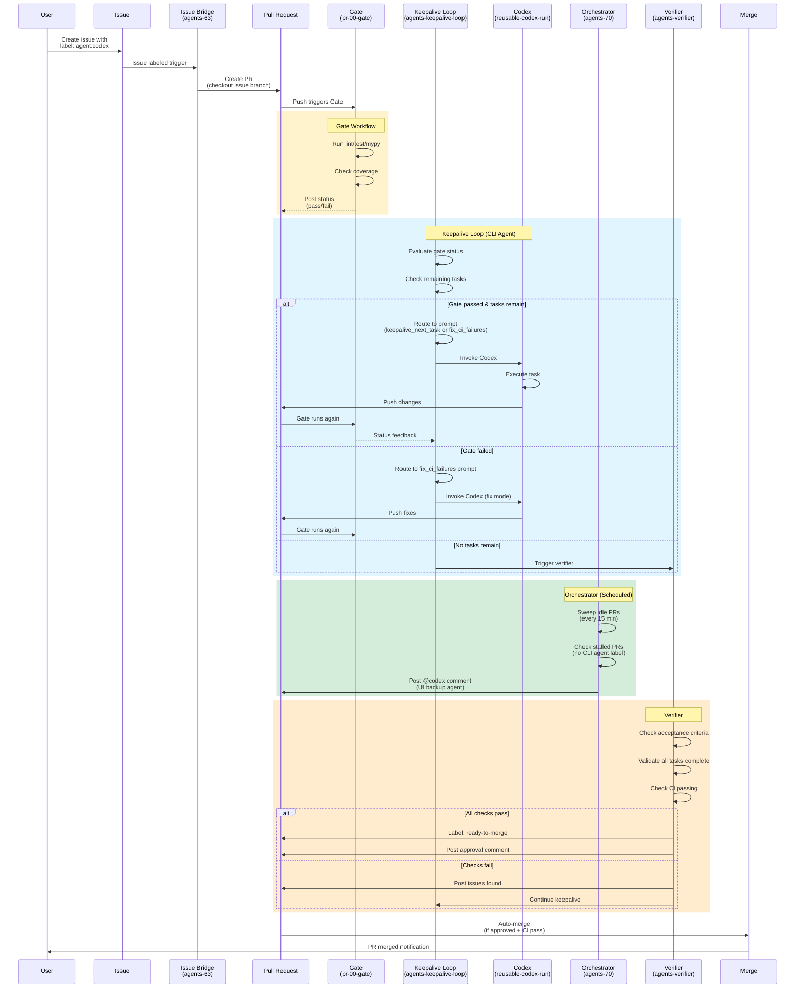

### Keepalive Decision Tree

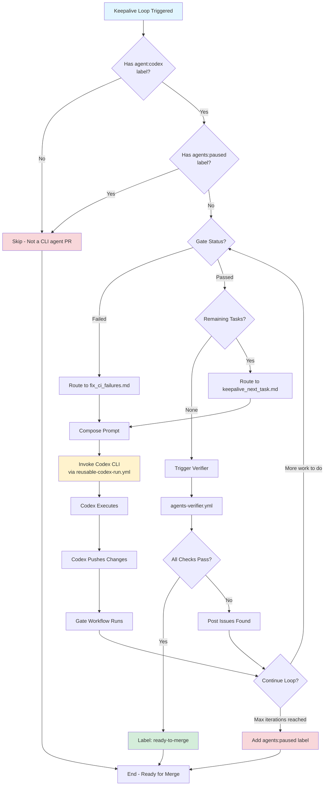

---

## Sync Mechanism

### Sync Architecture

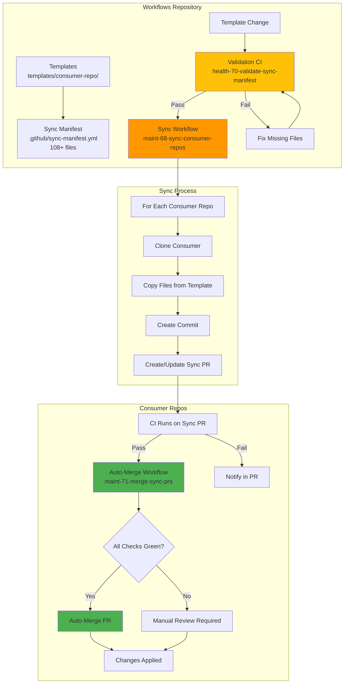

### Sync Manifest Structure

```yaml
# .github/sync-manifest.yml - Single Source of Truth

workflows:
  - source: .github/workflows/agents-70-orchestrator.yml
    description: "Scheduled orchestration"
  - source: .github/workflows/agents-keepalive-loop.yml
    description: "Keepalive iteration loop"
  # ... 35 total workflow entries

prompts:
  - source: .github/codex/prompts/keepalive_next_task.md
    description: "Normal work prompt"
  # ... 6 total prompt entries

scripts:
  - source: .github/scripts/keepalive_loop.js
    description: "Main keepalive loop logic"
  # ... 80+ script entries

templates:
  - source: .github/scripts/keepalive_instruction_template.js
    description: "Prompt generation template"

docs:
  - source: docs/ci/AGENT_ISSUE_FORMAT.md
    description: "Issue template format"
  # ... 4 doc entries

codex_config:
  - source: .github/codex/AGENT_INSTRUCTIONS.md
    description: "Agent security boundaries"

copilot_config:
  - source: .github/copilot/instructions.md
    description: "Copilot instructions"
  - source: .github/copilot/skills.yml
    description: "Copilot skills"

git_config:
  - source: .gitattributes
    description: "Git merge strategies"

# Special sync modes:
sync_modes:
  create_only:
    - .github/workflows/pr-00-gate.yml  # Repos customize coverage/python
    - .github/workflows/ci.yml           # Repo-specific CI config
    - .github/dependabot.yml             # Repo-specific dependencies
```

### Validation Flow

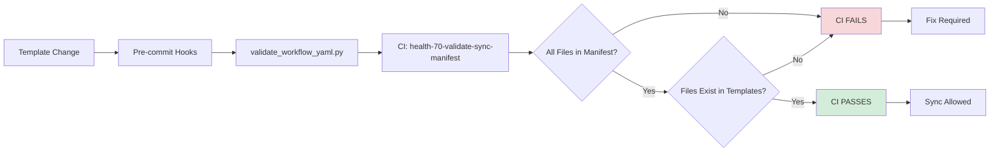

---

## Keepalive System

### Keepalive Architecture

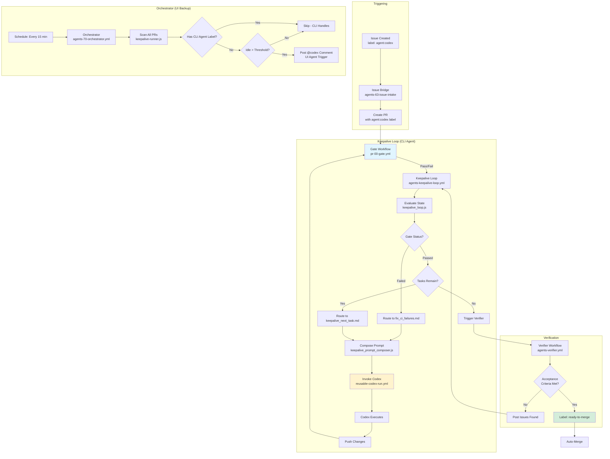

### Prompt Routing Logic

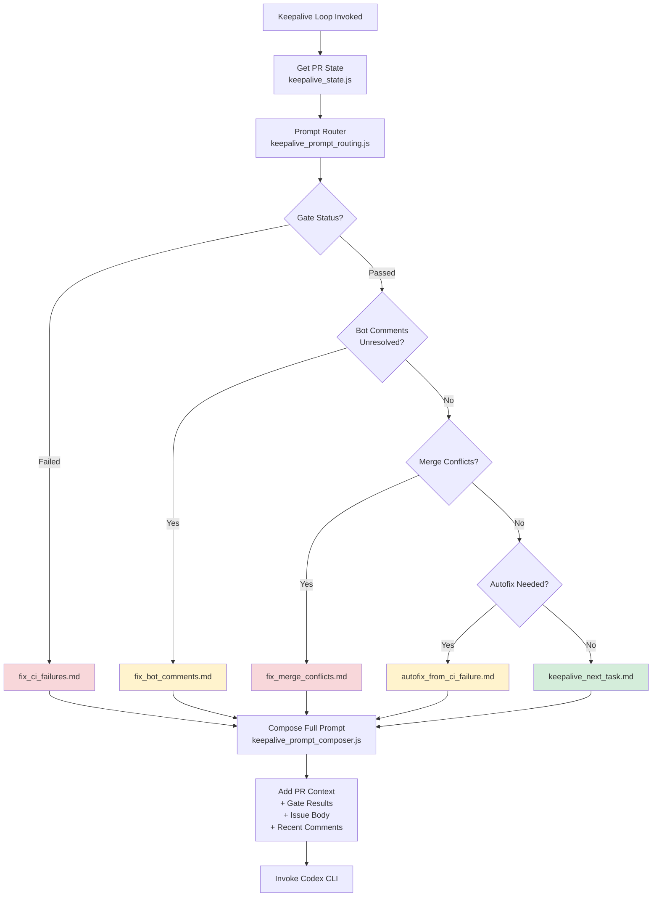

### Keepalive Contracts

```
┌─────────────────────────────────────────────────────────────────┐
│              KEEPALIVE SYSTEM CONTRACTS                          │
│  (Canonical Reference: docs/keepalive/GoalsAndPlumbing.md)      │
├─────────────────────────────────────────────────────────────────┤
│                                                                  │
│  INPUT CONTRACTS (What keepalive loop receives):                │
│  ├─ PR body: Automated Status Summary section                   │
│  │  └─ Format: Markdown with task checkboxes                    │
│  ├─ Gate workflow results: Pass/fail status                     │
│  ├─ PR labels: agent:codex, agents:paused, etc.                 │
│  └─ Issue body: Original tasks and acceptance criteria          │
│                                                                  │
│  OUTPUT CONTRACTS (What keepalive loop produces):               │
│  ├─ Codex invocation with composed prompt                       │
│  ├─ Updated PR body (Automated Status Summary)                  │
│  ├─ Labels: agents:paused (if max iterations)                   │
│  └─ Comments: Status updates, error messages                    │
│                                                                  │
│  STATE TRANSITIONS:                                              │
│  ├─ Gate Failed → Fix CI Mode                                   │
│  ├─ Gate Passed + Tasks → Normal Work Mode                      │
│  ├─ Gate Passed + No Tasks → Verification Mode                  │
│  ├─ Max Iterations → Pause (agents:paused label)                │
│  └─ Verification Pass → Ready to Merge                          │
│                                                                  │
│  OBSERVABILITY:                                                  │
│  ├─ keepalive_metrics_collector.py: Collect metrics             │
│  ├─ keepalive_metrics_dashboard.py: Generate dashboard          │
│  └─ Metrics schema: docs/keepalive/METRICS_SCHEMA.md            │
│                                                                  │
└─────────────────────────────────────────────────────────────────┘
```

---

## LangChain Integration

### LangChain System Architecture

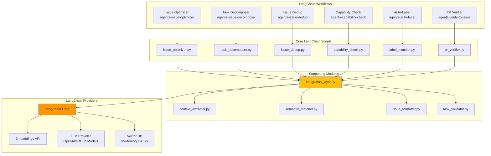

### LangChain Capabilities

```
┌─────────────────────────────────────────────────────────────────┐
│              LANGCHAIN INTEGRATION CAPABILITIES                  │
├─────────────────────────────────────────────────────────────────┤
│                                                                  │
│  ISSUE OPTIMIZATION (issue_optimizer.py)                         │
│  ├─ Improve issue clarity and structure                         │
│  ├─ Add missing sections (Why, Scope, Non-Goals)                │
│  ├─ Format tasks as checkboxes                                  │
│  └─ Validate against AGENT_ISSUE_TEMPLATE                       │
│                                                                  │
│  TASK DECOMPOSITION (task_decomposer.py)                         │
│  ├─ Break complex issues into smaller tasks                     │
│  ├─ Identify dependencies between tasks                         │
│  ├─ Generate sub-issues with appropriate labels                 │
│  └─ Maintain traceability (Part X of Y)                         │
│                                                                  │
│  DEDUPLICATION (issue_dedup.py)                                  │
│  ├─ Semantic similarity detection (embeddings)                  │
│  ├─ Identify duplicate/related issues                           │
│  ├─ Suggest merging or closing duplicates                       │
│  └─ Link related issues for context                             │
│                                                                  │
│  CAPABILITY CHECKING (capability_check.py)                       │
│  ├─ Assess if issue is suitable for agent automation            │
│  ├─ Identify required tools/permissions                         │
│  ├─ Flag human-only tasks                                       │
│  └─ Estimate complexity                                          │
│                                                                  │
│  AUTO-LABELING (label_matcher.py)                                │
│  ├─ Semantic label matching (embeddings)                        │
│  ├─ Apply appropriate component/priority labels                 │
│  ├─ Detect issue type (bug, feature, docs)                      │
│  └─ Suggest agent assignments                                   │
│                                                                  │
│  PR VERIFICATION (pr_verifier.py)                                │
│  ├─ Check acceptance criteria completion                        │
│  ├─ Validate PR content against issue                           │
│  ├─ Identify missing test coverage                              │
│  └─ Generate verification report                                │
│                                                                  │
└─────────────────────────────────────────────────────────────────┘
```

---

## File Structure Tree

```
Workflows Repository
├── .github/
│   ├── workflows/ (88 workflows)
│   │   ├── reusable-*.yml (13) ────────► Called via uses:
│   │   ├── agents-*.yml (27) ──────────► SYNCED to consumers
│   │   ├── maint-*.yml (27) ───────────► Workflows-only
│   │   ├── health-*.yml (16) ──────────► Validation
│   │   ├── selftest-*.yml (2) ─────────► Self-tests
│   │   ├── pr-00-gate.yml (1) ─────────► SYNCED (create_only)
│   │   └── autofix.yml (1) ────────────► SYNCED
│   │
│   ├── actions/ (5 composite actions)
│   │   ├── autofix/
│   │   ├── python-ci-setup/
│   │   ├── build-pr-comment/
│   │   ├── codex-bootstrap-lite/
│   │   └── signature-verify/
│   │
│   ├── scripts/ (58 files - Core Infrastructure)
│   │   ├── [API & Caching] (10 files)
│   │   ├── [Keepalive System] (13 files)
│   │   ├── [Agent System] (10 files)
│   │   ├── [CI & Error Handling] (12 files)
│   │   ├── [Issue & PR Utilities] (8 files)
│   │   └── [Python Helpers] (10 files)
│   │
│   ├── codex/
│   │   ├── prompts/ (6 prompt files)
│   │   │   ├── keepalive_next_task.md
│   │   │   ├── fix_ci_failures.md
│   │   │   ├── fix_bot_comments.md
│   │   │   ├── fix_merge_conflicts.md
│   │   │   ├── autofix_from_ci_failure.md
│   │   │   └── verifier_acceptance_check.md
│   │   └── AGENT_INSTRUCTIONS.md
│   │
│   ├── sync-manifest.yml ──────────────► Single source of truth (108+ files)
│   ├── copilot/
│   │   ├── instructions.md
│   │   └── skills.yml
│   └── ISSUE_TEMPLATE/
│       ├── agent_task.yml
│       └── config.yml
│
├── scripts/ (67+ files - Higher-Level Operations)
│   ├── [Core CI/Metrics] (10 files)
│   ├── langchain/ (13 files)
│   │   ├── capability_check.py
│   │   ├── issue_optimizer.py
│   │   ├── task_decomposer.py
│   │   ├── issue_dedup.py
│   │   ├── pr_verifier.py
│   │   └── [8 more LangChain modules]
│   ├── [Validation & Analysis] (15 files)
│   ├── [Keepalive & Metrics] (10 files)
│   └── [Maintenance] (12 files)
│
├── templates/consumer-repo/
│   ├── .github/
│   │   ├── workflows/ (34 workflow templates)
│   │   ├── scripts/ (80+ script templates)
│   │   ├── codex/ (6 prompts + AGENT_INSTRUCTIONS)
│   │   ├── copilot/ (instructions + skills)
│   │   └── ISSUE_TEMPLATE/
│   ├── scripts/langchain/ (13 LangChain helpers)
│   ├── config/
│   │   └── coverage-baseline.json.example
│   └── docs/
│       ├── ci/AGENT_ISSUE_FORMAT.md
│       └── [Other documentation]
│
├── docs/ (91+ files)
│   ├── README.md
│   ├── STRUCTURE.md
│   ├── INTEGRATION_GUIDE.md
│   ├── ci/ (16 files)
│   ├── keepalive/ (10 files)
│   │   ├── GoalsAndPlumbing.md ────────► Canonical keepalive reference
│   │   ├── SETUP_CHECKLIST.md
│   │   └── Agents.md
│   ├── ops/ (15+ files)
│   ├── plans/ (10+ files)
│   ├── guides/ (8+ files)
│   ├── templates/ (5 files)
│   └── archive/ (20+ files)
│
├── config/
│   ├── coverage-baseline.json
│   ├── labels-core.yml
│   └── labels.yml
│
├── CLAUDE.md ──────────────────────────► Project instructions
├── README.md
├── pyproject.toml ─────────────────────► Python config (line-length: 100)
├── .gitignore
├── .gitattributes
└── [Standard repo files]

Statistics:
├── 88 workflow files (~36,262 lines of YAML)
├── 125+ script files (58 in .github/scripts/, 67+ in scripts/)
├── 54 test files
├── 91+ documentation files
├── 6 Codex prompts
├── 5 GitHub Actions
└── 108+ files in sync manifest
```

---

## Data Flow Diagrams

### 1. Issue to PR Creation Flow

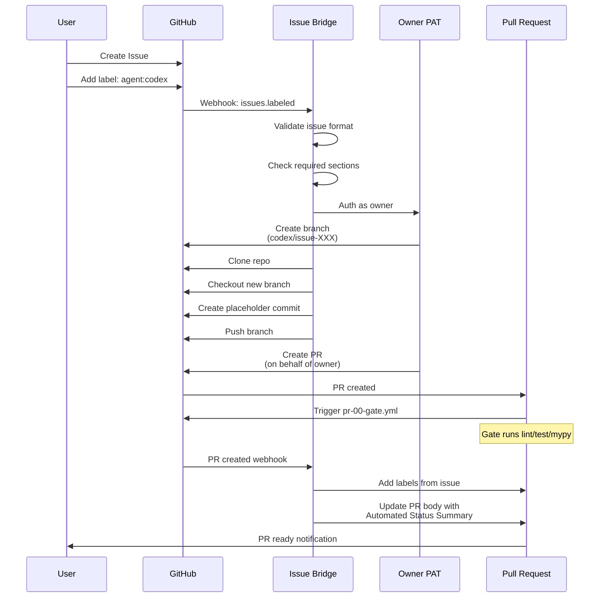

### 2. Gate Workflow Data Flow

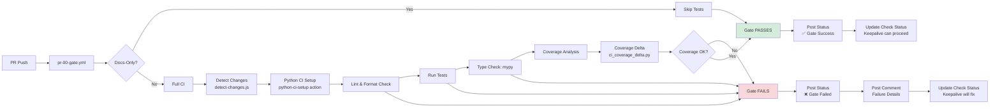

### 3. Codex Invocation Data Flow

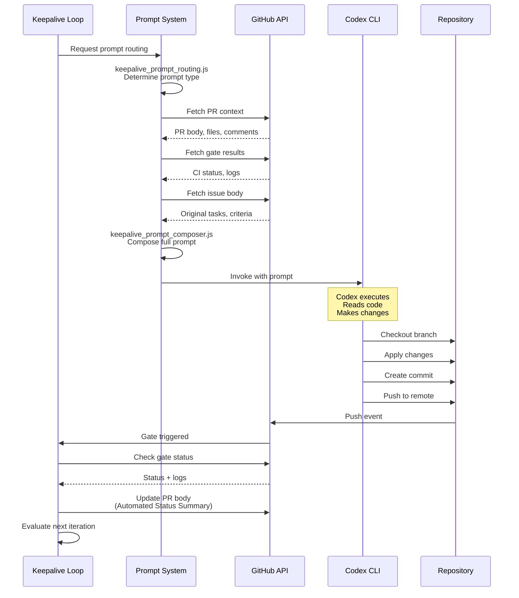

### 4. Sync Process Data Flow

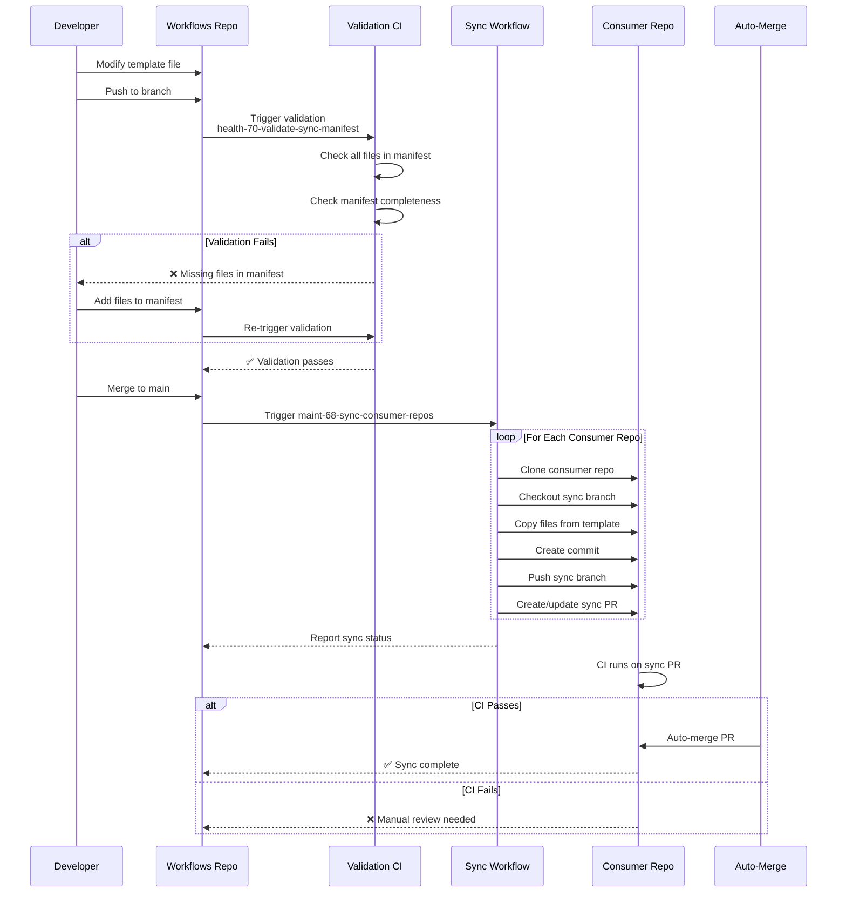

### 5. Agent Routing Data Flow

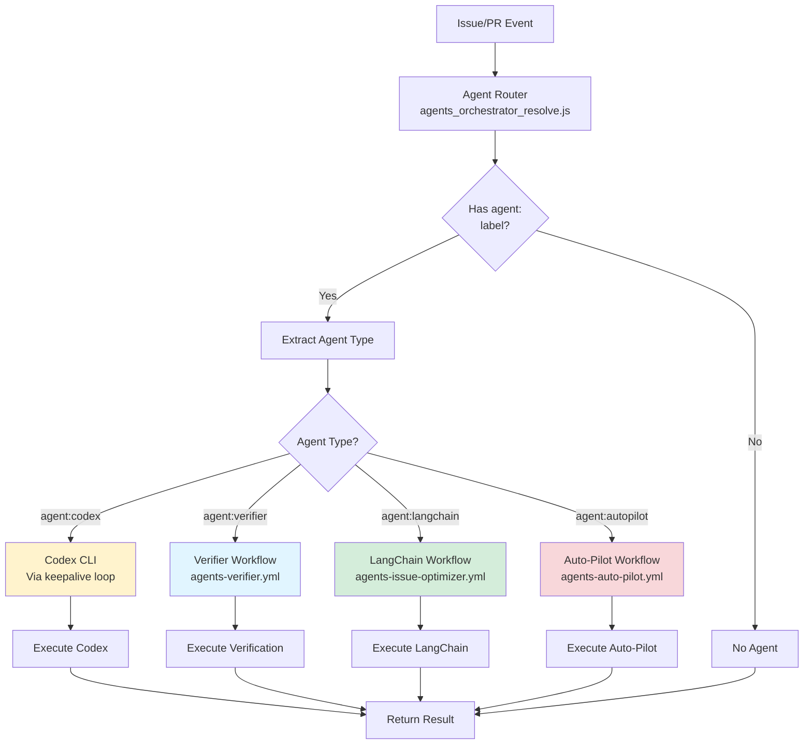

---

## Consumer Repo Integration Points

```
┌─────────────────────────────────────────────────────────────────┐
│                      CONSUMER REPO                              │
│               (e.g., Travel-Plan-Permission)                     │
├─────────────────────────────────────────────────────────────────┤
│                                                                  │
│  SYNCED FROM WORKFLOWS REPO (via maint-68):                     │
│  ├─ .github/workflows/agents-*.yml (27 workflows)               │
│  ├─ .github/scripts/*.js (48 files)                             │
│  ├─ .github/scripts/*.py (10 files)                             │
│  ├─ scripts/langchain/*.py (13 files)                           │
│  ├─ .github/codex/prompts/*.md (6 files)                        │
│  ├─ .github/codex/AGENT_INSTRUCTIONS.md                         │
│  └─ docs/ci/AGENT_ISSUE_FORMAT.md                               │
│                                                                  │
│  CALLS REUSABLE WORKFLOWS (from Workflows repo):                │
│  ├─ stranske/Workflows/.github/workflows/reusable-10-ci-python.yml@v1
│  ├─ stranske/Workflows/.github/workflows/reusable-codex-run.yml@v1
│  ├─ stranske/Workflows/.github/workflows/reusable-agents-verifier.yml@v1
│  └─ [10 more reusable workflows]                               │
│                                                                  │
│  LOCAL CUSTOMIZATIONS (NOT synced):                             │
│  ├─ .github/workflows/ci.yml ─────► Repo-specific CI config     │
│  ├─ .github/workflows/pr-00-gate.yml* ► Customizable gate       │
│  ├─ README.md ─────────────────────► Repo-specific docs         │
│  ├─ .gitignore ────────────────────► Repo-specific patterns     │
│  ├─ config/coverage-baseline.json ─► Per-repo coverage baseline │
│  └─ autofix-versions.env ──────────► Dependency versions        │
│                                                                  │
│  * = Synced with create_only mode (initial only, not overwritten)
│                                                                  │
└─────────────────────────────────────────────────────────────────┘
                              │
                              │ uses:
                              ▼
┌─────────────────────────────────────────────────────────────────┐
│                    WORKFLOWS REPO (v1 Tag)                       │
├─────────────────────────────────────────────────────────────────┤
│  REUSABLE WORKFLOWS (called via uses:):                         │
│  └─ stranske/Workflows/.github/workflows/reusable-*.yml@v1      │
│                                                                  │
│  These are NOT copied to consumer repos.                        │
│  They are REFERENCED and executed in Workflows repo context.    │
└─────────────────────────────────────────────────────────────────┘
```

---

## Key Insights Summary

### 1. Two-Level Architecture

**Reusable Workflows (13)**: Called via `uses:`, NOT synced
- CI orchestration (Python, Node, Docker)
- Agent execution framework
- Orchestrator infrastructure
- PR management utilities

**Synced Workflows (29)**: Copied to consumer repos, run locally
- Agent workflows (orchestrator, keepalive, verifier)
- Codex belt system
- LangChain integrations
- CI gate and autofix

### 2. Sync Policy Enforcement

**Single Source of Truth**: `.github/sync-manifest.yml`
- 108+ files tracked
- Validation CI prevents incomplete syncs
- Auto-merge workflow ensures consistency
- Drift detection catches desync

### 3. Keepalive System Design

**CLI Agent Primary**: Workflow-based automation
- Triggered by labels, not comments
- Prompt routing based on state
- Gate-aware execution
- Automatic verification

**UI Agent Backup**: Comment-based (@codex)
- Orchestrator posts comments for idle PRs
- Skips PRs with CLI agent labels
- Manual intervention fallback

### 4. LangChain Integration

**13 Python modules** for semantic analysis:
- Issue optimization and decomposition
- Deduplication via embeddings
- Capability checking
- Auto-labeling
- PR verification

### 5. Metrics & Observability

**Comprehensive tracking**:
- Ledger system for metadata
- Coverage delta calculation
- Keepalive metrics collection
- Weekly aggregation and dashboard
- Autopilot step timing

### 6. Security Boundaries

**Defense in depth**:
- Prompt injection guards
- Prompt integrity verification
- CI signature validation
- GitHub App auth (preferred)
- Token load balancing

---

## Visual Legend

```
Color Coding Used in Diagrams:
├─ 🟦 Blue (#e1f5ff) ────► Reusable workflows
├─ 🟨 Yellow (#fff3cd) ───► Agent system / Codex
├─ 🟩 Green (#d4edda) ────► Success / Maintenance
├─ 🟥 Red (#f8d7da) ──────► Health checks / Errors
├─ 🟧 Orange (#ff9800) ───► Sync operations
└─ 🟫 Amber (#ffc107) ────► Configuration / Manifest
```

---

## Quick Reference

### Most Important Files

| File | Purpose |
|------|---------|
| `.github/sync-manifest.yml` | Single source of truth for sync |
| `.github/workflows/reusable-codex-run.yml` | Codex agent execution |
| `.github/scripts/keepalive_loop.js` | Main keepalive logic |
| `scripts/langchain/integration_layer.py` | LangChain integration |
| `docs/keepalive/GoalsAndPlumbing.md` | Canonical keepalive design |
| `CLAUDE.md` | Project instructions and guidelines |

### Most Important Workflows

| Workflow | Frequency | Purpose |
|----------|-----------|---------|
| `pr-00-gate.yml` | Every push | CI validation gate |
| `agents-keepalive-loop.yml` | After gate | Codex CLI iteration |
| `agents-70-orchestrator.yml` | Every 15 min | Sweep idle PRs |
| `maint-68-sync-consumer-repos.yml` | On template change | Sync to consumers |
| `health-70-validate-sync-manifest.yml` | Every push | Validate manifest |

### Consumer Repos

| Repo | Status | Notes |
|------|--------|-------|
| Travel-Plan-Permission | Reference | Gold standard |
| Manager-Database | Consumer | Has custom ci.yml |
| Template | Consumer | Minimal Python template |
| trip-planner | Consumer | Has custom ci.yml |

---

## Related Documentation

- [Repository Structure](STRUCTURE.md) - Detailed file organization
- [Integration Guide](INTEGRATION_GUIDE.md) - How to integrate consumer repos
- [Keepalive System](keepalive/GoalsAndPlumbing.md) - Canonical keepalive design
- [CI System](ci/WORKFLOWS.md) - Workflow reference
- [CLAUDE.md](../CLAUDE.md) - Project instructions (READ THIS FIRST)

---

**Last Updated**: 2026-01-26
**Maintainer**: stranske organization
**Status**: Living document - updated with codebase changes
